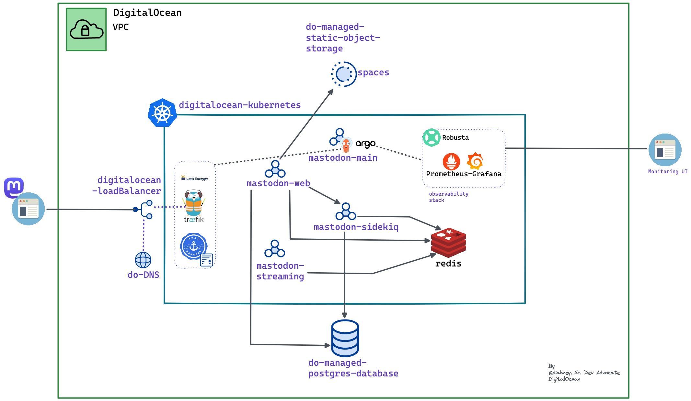

# Setting up Mastodon on DigitalOcean Kubernetes

## Introduction

This is a quick start guide to set up a Mastodon instance running on DigitalOcean Kubernetes. It starts with a high-level overview of Mastodon and all involved components. Then, you will be guided through the initial installation and configuration steps. Finally, you should be able to see your final Mastodon instance alive and kicking and also evaluate its performance under heavy load.

[Mastodon](https://docs.joinmastodon.org) is a microblogging platform similar to Twitter. It lets you create small posts, follow people, react to other people’s posts, etc. Mastodon is an open-source and actively developed project; thus, it is constantly improved. The main goal is to offer people more freedom and not rely on or depend on big tech companies (in contrast with what happened to Twitter lately).

From an architectural point of view, Mastodon follows a decentralized approach compared to Twitter. It means everyone can run their Mastodon instance all over the world independently and then interconnect with other instances via federation. This approach gives more freedom because you can operate alone or in small groups if desired.

At its heart, the Mastodon stack is powered by the following components:

1. The ***main backend*** is written in Ruby implementing core logic (using the Ruby on Rails framework). It also implements the web frontend for all users.
2. A ***streaming engine*** implemented using NodeJS used for real-time feed updates
3. ***Sidekiq*** jobs used by the primary backend to propagate data to other Mastodon instances
4. An in-memory database (***Redis***) is used for caching and as data storage for Mastodon Sidekiq jobs
5. A ***PostgreSQL database*** is the primary storage for all posts and media. This is the source of truth for the whole system
6. An ***ElasticSearch engine*** (optionally) is used to index and search for posts you have authored, favourited, or mentioned
7. ***S3 storage*** for the rest of persisted data, such as media caching

## Overview

```bash
# Repository structure
.
├── README.md
├── bootstrap # cluster bootstrapping using Argo CD
├── docs # documents and assets
├── infrastructure  # infrastructure automation using Terraform
├── mastodon  # mastodon installation 
└── observability # set up observability stack
```

Follow the guide in the order stated below:

1. [DigitalOcean Infrastructure Automation via Terraform](./infrastructure/terraform/README.md)
2. [Mastodon installation using Bitnami Helm chart](./mastodon/README.md)
3. [Set up Observability using Robusta](./observability/README.md)

Here is the overview of the architecture that we will set up:

<!--  -->


**Happy Mastodoning!**
